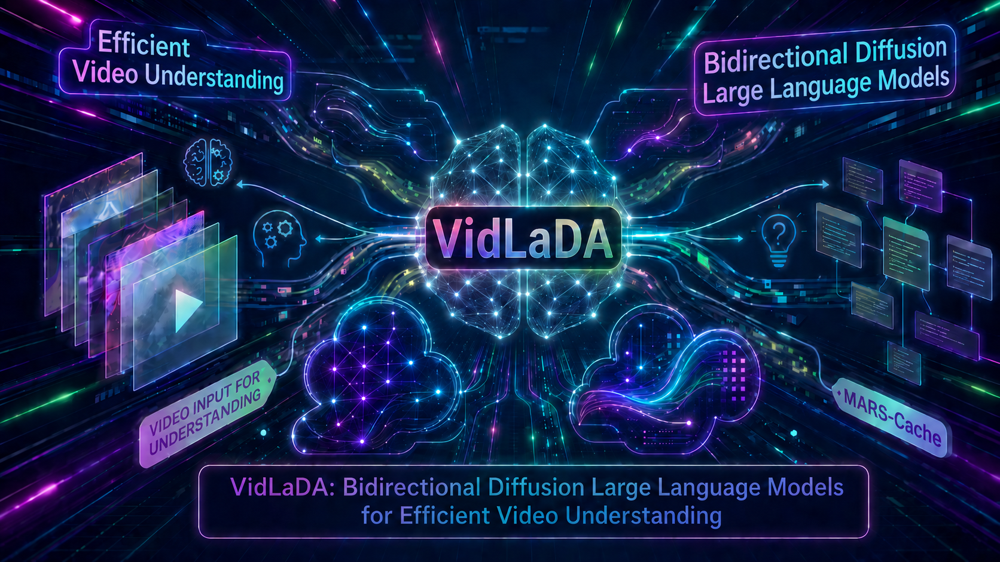
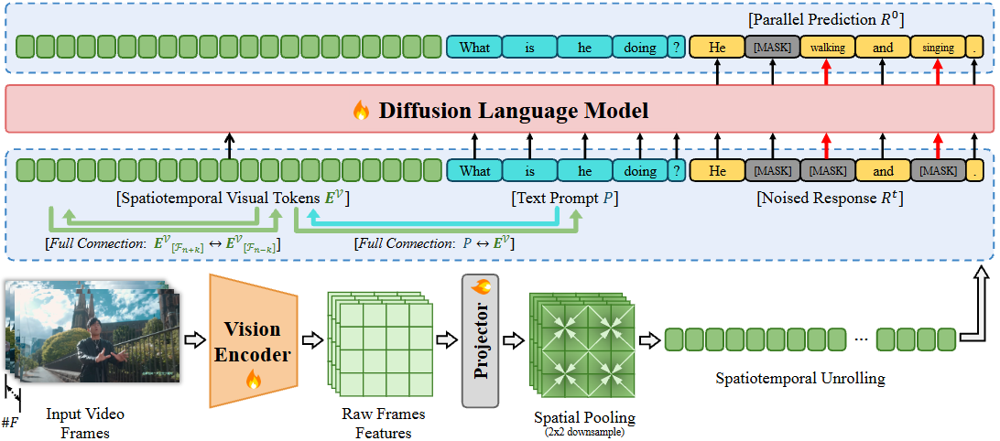

# VidLaDA: Bidirectional Diffusion Large Language Models for Efficient Video Understanding

<p align="center">
  
</p>

<p align="center">
  <a href="https://arxiv.org/pdf/2601.17868"></a>
  <a href="https://huggingface.co/ziHoHe/VidLaDA-8B"></a>
  
</p>

## 🔥 News

- **[2026.05]** 🎉 Accepted by **ICML 2026**.
- **[2026.01]** 📄 We released the paper on [arXiv](https://arxiv.org/pdf/2601.17868).

## 📝 Overview

VidLaDA is a video large language model based on diffusion language modeling. It uses bidirectional attention for global spatiotemporal aggregation and parallel token decoding for efficient video understanding.
<p align="center">
  
</p>

## 🛠️ Requirements and Installation

Basic dependencies:

- Python 3.10
- PyTorch 2.5.1
- Transformers 4.43.4
- Triton 3.1.0
- CUDA-compatible GPU

Create and activate a conda environment:

```bash
conda create -n vidlada python=3.10 -y
conda activate vidlada
```

Clone the repository:

```bash
git clone https://github.com/ziHoHe/VidLaDA
cd VidLaDA
```

Install PyTorch. We recommend PyTorch 2.5.1:

```bash
pip install torch==2.5.1 torchvision==0.20.1 torchaudio==2.5.1
```

Install VidLaDA and the evaluation package:

```bash
bash init_env.sh
```

## 🤗 Model Zoo

| Model | Checkpoint |
| --- |  --- |
| VidLaDA-8B |  [`ziHoHe/VidLaDA-8B`](https://huggingface.co/ziHoHe/VidLaDA-8B) |

## 🏋️ Training

We provide a training entry point based on LLaVA-Video-178K.

**LLaVA-Video-178K training example**

Before launching `exp.sh`, update the local model and dataset paths for your machine:

| Variable | Description |
| --- | --- |
| `LLM_VERSION` | Base checkpoint. The default is [`GSAI-ML/LLaDA-V`](https://huggingface.co/GSAI-ML/LLaDA-V). |
| `VISION_MODEL_VERSION` | Vision tower model name. The default is `google/siglip2-so400m-patch14-384`. |
| `VISION_TOWER_CACHE_DIR` | **Optional** local root for cached vision tower weights. The loader first checks `${VISION_TOWER_CACHE_DIR}/${VISION_MODEL_VERSION}` and falls back to the Hugging Face model name if the local path is unavailable. |
| `VIDEO_FOLDER` | Root directory for LLaVA-Video-178K videos. Download from [`lmms-lab/LLaVA-Video-178K`](https://huggingface.co/datasets/lmms-lab/LLaVA-Video-178K). |

Then replace all absolute `json_path` entries in `train/scripts/data/exp.yaml` with your downloaded LLaVA-Video-178K annotation paths.

```bash
cd train
bash scripts/video/train/exp.sh
```

The training script infers the number of visible GPUs with `nvidia-smi` and launches distributed training with `torchrun`. For multi-node training, pass the number of nodes after the script name and set the standard launch variables on each node:

```bash
MASTER_ADDR=<master-node-ip> MASTER_PORT=29199 RANK=<node-rank> \
bash scripts/video/train/exp.sh <num_nodes>
```

For example, use `bash scripts/video/train/exp.sh 2` for a 2-node run, with `RANK=0` on the master node and `RANK=1` on the second node.

## 📊 Evaluation

Before running evaluation, download the benchmark datasets under your `HF_HOME` directory. The task loaders use `HF_HOME` as the base directory for cached video files; in the YAML files listed below, update the `dataset_path` field to your local annotation/dataset root.

Evaluation datasets:

| Task | Download | Path to update |
| --- | --- | --- |
| `video_mmmu` | [`lmms-lab/VideoMMMU`](https://huggingface.co/datasets/lmms-lab/VideoMMMU) | `eval/lmms-eval/lmms_eval/tasks/videommmu/_default_template_yaml` |
| `longvideobench_val_v` | [`longvideobench/LongVideoBench`](https://huggingface.co/datasets/longvideobench/LongVideoBench) | `eval/lmms-eval/lmms_eval/tasks/longvideobench/longvideobench_val_v.yaml` |
| `lvbench` | [`lmms-lab/LVBench`](https://huggingface.co/datasets/lmms-lab/LVBench) | `eval/lmms-eval/lmms_eval/tasks/lvbench/lvbench.yaml` |
| `egoschema` | [`lmms-lab/egoschema`](https://huggingface.co/datasets/lmms-lab/egoschema) | `eval/lmms-eval/lmms_eval/tasks/egoschema/_default_template_yaml` |
| `mvbench` | [`OpenGVLab/MVBench`](https://huggingface.co/datasets/OpenGVLab/MVBench) | `eval/lmms-eval/lmms_eval/tasks/mvbench/_default_template_yaml` |
| `mlvu_dev` | [`sy1998/MLVU_dev`](https://huggingface.co/datasets/sy1998/MLVU_dev) | `eval/lmms-eval/lmms_eval/tasks/mlvu/mlvu_dev.yaml` |
| `mlvu_test` | [`sy1998/MLVU_Test`](https://huggingface.co/datasets/sy1998/MLVU_Test) | `eval/lmms-eval/lmms_eval/tasks/mlvu/mlvu_test.yaml` |
| `videomme` | [`lmms-lab/Video-MME`](https://huggingface.co/datasets/lmms-lab/Video-MME) | `eval/lmms-eval/lmms_eval/tasks/videomme/videomme.yaml` |

We provide evaluation code based on [lmms-eval](https://github.com/EvolvingLMMs-Lab/lmms-eval). The main VidLaDA model wrapper is:

- `llava_llada_video`

The evaluation scripts are local launchers; edit cache paths and model defaults if needed.

Standard video evaluation:

```bash
cd train
bash scripts/video/eval/eval_video.sh
```

## 📌 Citation

```bibtex
@article{he2026vidlada,
  title={VidLaDA: Bidirectional Diffusion Large Language Models for Efficient Video Understanding},
  author={He, Zhihao and Chen, Tieyuan and Wang, Kangyu and Qin, Ziran and Shao, Yang and Gan, Chaofan and Li, Shijie and Wu, Zuxuan and Lin, Weiyao},
  journal={arXiv preprint arXiv:2601.17868},
  year={2026}
}
```

## 🙏 Acknowledgments

This codebase builds on [LLaDA-V](https://github.com/ML-GSAI/LLaDA-V), [LLaVA-NeXT](https://github.com/LLaVA-VL/LLaVA-NeXT), and [lmms-eval](https://github.com/EvolvingLMMs-Lab/lmms-eval). We thank the authors and maintainers for their open-source contributions.
